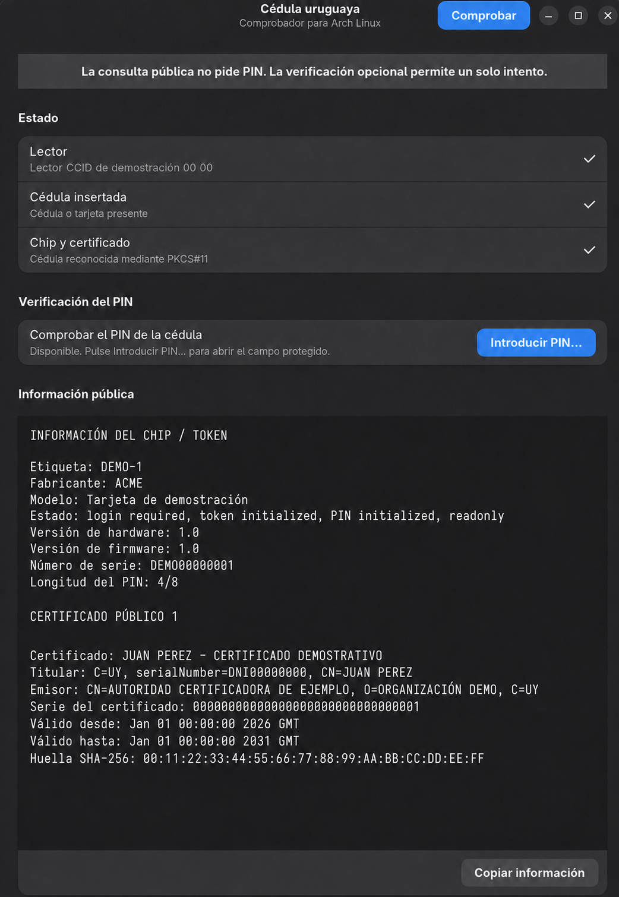

# Cédula uruguaya con chip en Arch Linux y derivados

Automatizador comunitario para adaptar a Arch Linux y sus derivados el
**Classic Client 7.5 para Ubuntu** publicado por Agesic y preparar la firma
mediante PKCS#11. El procedimiento fue desarrollado y probado en CachyOS.

No es software oficial de Agesic ni de Thales. El controlador sigue siendo
privativo; este proyecto solamente automatiza su empaquetado y configuración.

## Licencia

El código y la documentación propios de este proyecto se publican bajo la
[licencia MIT](LICENSE).

Classic Client, SConnect y cualquier otro componente descargado desde sitios de
terceros conservan las licencias de sus respectivos titulares. Este repositorio
no los redistribuye ni cambia sus condiciones de uso.

## Qué hace

- Comprueba que el sistema sea Arch Linux o un derivado compatible, x86-64.
- Descarga el DEB oficial o acepta uno ya descargado con `--deb`.
- Verifica el SHA-256 conocido antes de usar el archivo.
- Lo convierte en un paquete administrado por `pacman` mediante `makepkg`.
- Instala las dependencias y activa `pcscd.socket`.
- registra `/usr/lib/pkcs11/libgclib.so` en la base NSS compartida por
  Chromium/Brave.
- Instala y configura el host SConnect para Brave y Google Chrome.
- Opcionalmente instala Okular.
- Crea respaldos de la configuración de usuario que modifica.

El script **no pide, lee ni guarda el PIN de la cédula**.

## Fuentes fijadas

- DEB: <https://archivos.agesic.gub.uy/nextcloud/index.php/s/8kqSb9z4xKABM8T>
- Si deja de funcionar: <https://www.gub.uy/agencia-gobierno-electronico-sociedad-informacion-conocimiento/firma-digital/drivers-para-usar-cedula-digital>
- SConnect: <https://www.sconnect.com/extensions/sconnect-host-v2.16.1.0.tar.gz>

Las versiones y hashes están fijados deliberadamente. Si el proveedor sustituye
un archivo, el instalador se detiene en vez de ejecutar contenido desconocido.

## Uso desde cero

Extraer la carpeta, abrir una terminal dentro de ella y ejecutar como usuario
normal, no como `root`:

```bash
chmod +x cedula-uruguaya-arch.py
./cedula-uruguaya-arch.py instalar --con-okular
```

Si ya se descargó el paquete oficial:

```bash
./cedula-uruguaya-arch.py instalar \
  --deb ~/Descargas/libclassicclient_7.5.0-b01.02_Uruguay_ubuntu.amd64.deb \
  --con-okular
```

Antes de modificar NSS o SConnect, el programa exige cerrar Brave y Chrome. La
contraseña de `sudo`, si corresponde, sólo la solicita `sudo` para instalar
paquetes del sistema.

Después hay que instalar manualmente la extensión oficial **SConnect** en cada
navegador que se vaya a usar. Su identificador esperado es:

```text
mjhbkkaddmmnkghdnnmkjcgpphnopnfk
```

La extensión es una acción manual porque las políticas de Chromium no permiten
que un script de usuario instale silenciosamente extensiones de manera fiable y
segura.

## Diagnóstico y prueba

El diagnóstico no modifica el sistema:

```bash
./cedula-uruguaya-arch.py diagnosticar
```

Con lector y cédula conectados, se puede comprobar que PKCS#11 detecta el token
sin solicitar el PIN:

```bash
./cedula-uruguaya-arch.py verificar
```

Para comprobar por separado el lector, detectar si la cédula está insertada y
mostrar la información pública del chip y sus certificados:

```bash
./comprobar-cedula.py
```

El comprobador muestra datos personales incluidos en el certificado, como el
nombre y el número de documento. No solicita el PIN, no lee claves privadas y
no modifica el sistema.

En GNOME también puede utilizarse la interfaz gráfica GTK 4:

```bash
./comprobar-cedula-gui.py
```

La aplicación gráfica comprueba el lector, la tarjeta y el certificado, permite
copiar la información pública y ofrece una verificación opcional del PIN. Esta
usa un campo enmascarado y un seudoterminal efímero: el PIN no se pasa mediante
argumentos o variables de entorno, y sólo se permite un intento por apertura de
la aplicación. Si el token informa pocos intentos, último intento o bloqueo, el
botón permanece deshabilitado.



_Captura demostrativa: la identidad, los números de serie y la huella del
certificado son ficticios._

Para comprobar además que el PIN sea aceptado:

```bash
./comprobar-cedula.py --verificar-pin
```

Esta opción sólo funciona directamente en una terminal interactiva. Advierte
del riesgo, comprueba que el token no informe pocos intentos o bloqueo y exige
escribir `VERIFICAR` antes de realizar un único intento. `pkcs11-tool` solicita
el PIN con entrada oculta y verifica la sesión mediante una lectura de
certificados públicos. El PIN no se pasa como argumento ni se guarda.

Para firmar en la web se elige **Cédula de Identidad con chip en Navegador**. Es
posible que el sitio muestre una advertencia de compatibilidad de SConnect aun
cuando la firma funcione; el resultado debe confirmarse descargando el PDF y
verificando su firma.

Para Okular, seleccione el motor de firmas **NSS** y la base:

```text
~/.pki/nssdb
```

## Desinstalación

Esta operación elimina únicamente el módulo NSS con el nombre usado por el
script, los dos manifiestos creados, el host SConnect y el paquete Classic
Client. Primero crea un respaldo:

```bash
./cedula-uruguaya-arch.py desinstalar --confirmar
```

Para solicitar también la retirada de Okular:

```bash
./cedula-uruguaya-arch.py desinstalar --confirmar --quitar-okular
```

Los respaldos propios quedan en:

```text
~/.local/share/cedula-uruguaya-arch/backups/
```
